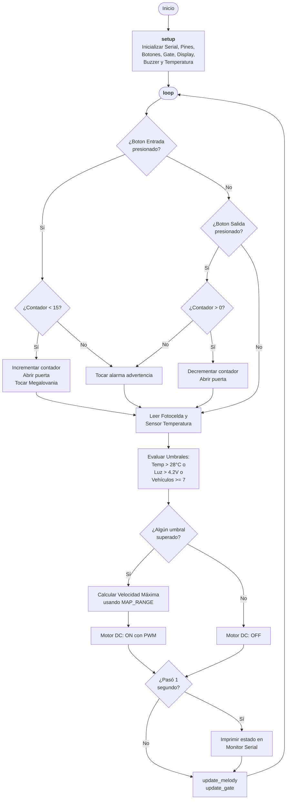

# Proyecto 2 - Arduino 101

El siguiente codigo hace parte de la entrega del proyecto #2 de mi clase de Arduino 101. 
El proyecto esta hecho en PlatformIO, todo el codigo fuente se puede encontrar en la carpeta de `src`.

# Diagrama de Flujo
A continuacion se muestra el diagrama de flujo del codigo implementado.

